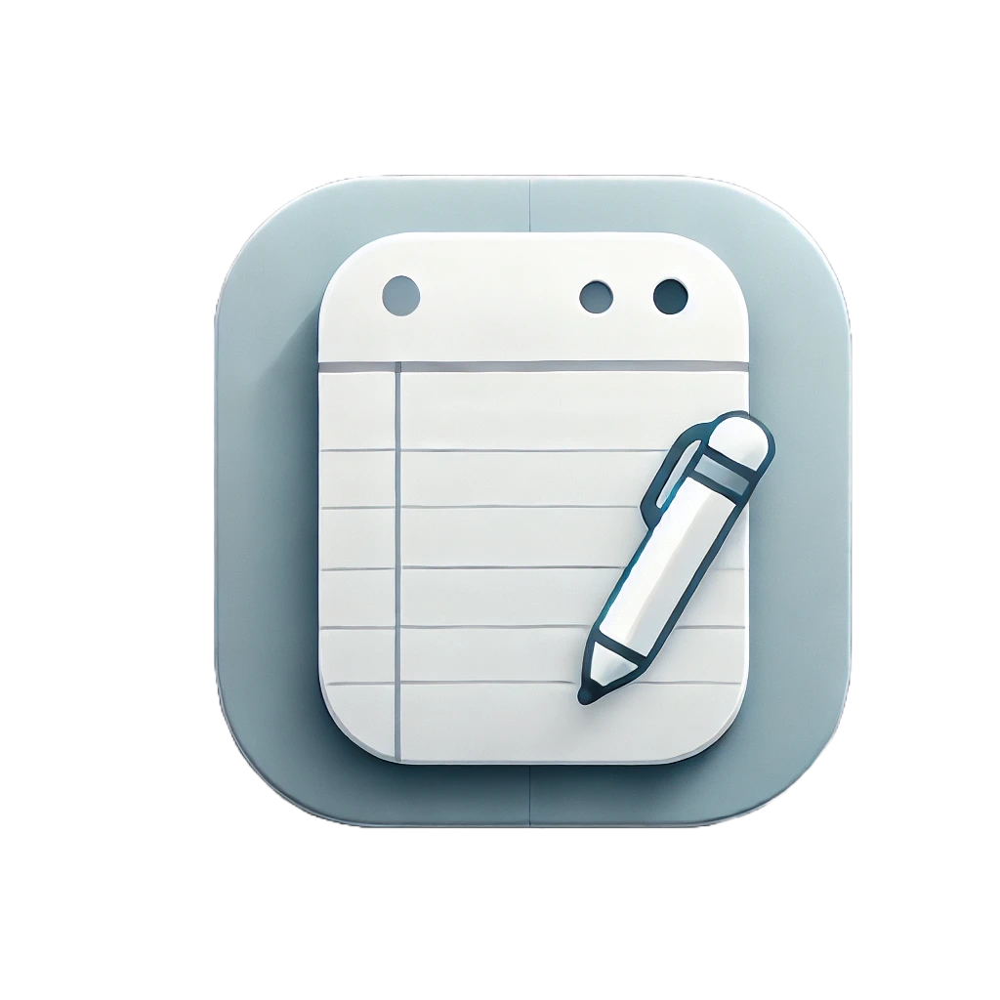

<!-- Improved compatibility of back to top link: See: https://github.com/othneildrew/Best-README-Template/pull/73 -->
<a name="readme-top"></a>
<!--
*** Thanks for checking out the Best-README-Template. If you have a suggestion
*** that would make this better, please fork the repo and create a pull request
*** or simply open an issue with the tag "enhancement".
*** Don't forget to give the project a star!
*** Thanks again! Now go create something AMAZING! :D
-->

<!-- PROJECT SHIELDS -->
<!--
*** I'm using markdown "reference style" links for readability.
*** Reference links are enclosed in brackets [ ] instead of parentheses ( ).
*** See the bottom of this document for the declaration of the reference variables
*** for contributors-url, forks-url, etc. This is an optional, concise syntax you may use.
*** https://www.markdownguide.org/basic-syntax/#reference-style-links
-->
[![Contributors][contributors-shield]][contributors-url]
[![Forks][forks-shield]][forks-url]
[![Stargazers][stars-shield]][stars-url]
[![Issues][issues-shield]][issues-url]
[![MIT License][license-shield]][license-url]
[![LinkedIn][linkedin-shield]][linkedin-url]

<!-- PROJECT LOGO -->
<br />
<div align="center">
  <a href="https://github.com/Phunguy65/NoteAwesome">
    
  </a>

<h3 align="center">NoteAwesome</h3>

  <p align="center">
    Ứng dụng ghi chú đa nền tảng
    <br />
    <a href="https://github.com/Phunguy65/NoteAwesome/tree/main/docs"><strong>Explore the docs »</strong></a>
    <br />
    <br />
    <a href="https://github.com/Phunguy65/NoteAwesome/releases/tag/v1.0.0">Download App</a>
    ·
    <a href="https://github.com/Phunguy65/NoteAwesome/issues/new?labels=bug&template=bug_report.md">Report Bug</a>
    ·
    <a href="https://github.com/Phunguy65/NoteAwesome/issues/new?labels=enhancement&template=feature_request.md">Request Feature</a>
  </p>
</div>

<!-- TABLE OF CONTENTS -->
<details>
  <summary>&#128221; Tables of Contents</summary>
  <ol>
    <li>
      <a href="#monocle_face-about-the-project">About The Project</a>
      <ul>
        <li><a href="#hammer_and_wrench-built-with">Built With</a></li>
      </ul>
    </li>
    <li>
      <a href="#checkered_flag-getting-started">Getting Started</a>
      <ul>
        <li><a href="#prerequisites">Prerequisites</a></li>
        <li><a href="#hourglass_flowing_sand-installation">Installation</a></li>
      </ul>
    </li>
    <li><a href="#dart-usage">Usage</a></li>
    <li><a href="#chart_with_upwards_trend-roadmap">Roadmap</a></li>
    <li><a href="#tada-contributing">Contributing</a></li>
    <li><a href="#page_with_curl-license">License</a></li>
    <li><a href="#email-contact">Contact</a></li>
    <li><a href="#pencil2-authors">Authors</a></li>
  </ol>
</details>

<!-- ABOUT THE PROJECT -->

## :monocle_face: About The Project

![Product Name Screen Shot][product-screenshot-01]

![Product Name Screen Shot][product-screenshot-02]

* `NoteAwesome` là ứng dụng ghi chú đa nền tảng, được phát triển bằng ngôn ngữ lập trình
  **Java**.

* Đây là dự án tổng kết kiến thức đã học, đồng thời là đồ án môn học **Lập trình hướng đối tượng bằng ngôn ngữ Java**,
  tại ***Học viện Công nghệ Bưu chính Viễn thông Cơ sở tại TP.HCM***, dưới sự hướng dẫn của cô
  ***Nguyễn Thị Tuyết Hải***.

> :bulb: **Ưu điểm**:
>
> * Ứng dụng có giao diện thân thiện, dễ sử dụng.
> * Quản lý ghi chú tập trung.
>
> :warning: **Nhược điểm**:
>
> * Ứng dụng chỉ thiết kế đơn luồng, đồng thời còn nhiều tính năng chưa được hoàn thiện.

<p align="right">(<a href="#readme-top">back to top</a>)</p>

### :hammer_and_wrench: Built With

- [![Java][java]][java-url]
- [![JavaFX][javafx]][javafx-url]
- [![Spring][spring]][spring-url]
- [![Spring Boot][spring-boot]][spring-boot-url]
- [![Maven][maven]][maven-url]

<p align="right">(<a href="#readme-top">back to top</a>)</p>

<!-- GETTING STARTED -->

## :checkered_flag: Getting Started

- Để biết thêm thông tin về đồ án này, hãy xem [Docs](docs/)

### Prerequisites

1. Cài đặt Java 23

- OpenJDK 23
  ```sh
  https://openjdk.org/
  ```

2. Chọn một trong các IDE

- Eclipse
  ```sh
  https://www.eclipse.org/
  ```
- NetBeans
  ```sh
    https://netbeans.apache.org/
    ```
- IntelliJ IDEA Community
  ```sh
  https://www.jetbrains.com/idea/
  ```

### :hourglass_flowing_sand: Installation

1. Tải project từ GitHub

   ```sh
   git clone https://github.com/Phunguy65/NoteAwesome.git
   ```

2. Mở project bằng Ide

3. Tải các gói phụ thuộc

   ```sh
   mvn clean install
   ```

4. Chạy ứng dụng

   ```sh
    mvn spring-boot:run
    ```

:bulb: Hàm [**main**](src/main/java/com/note_awesome/NoteAwesomeFX.java) là hàm chạy chính của ứng dụng.

```java
<p align="right">(<a href="#readme-top">back to top</a>)</p>

<!-- USAGE EXAMPLES -->

## :dart: Usage

Hiện tại, tài liệu hướng dẫn sử dụng chỉ dành cho những người dùng cuối, vì vậy, tài liệu chỉ mô tả các tính năng của
ứng dụng.

*Để biết thêm chi tiết, vui lòng xem tài liệu hướng dẫn tại [Docs](docs/)*

<p align="right">(<a href="#readme-top">back to top</a>)</p>

<!-- ROADMAP -->

## :chart_with_upwards_trend: Roadmap

- [x] Giới thiệu về ứng dụng
    - [x] [Các tính năng](../docs/FeatureRequest.md)

- Click [open issues](https://github/Phunguy65/NoteAwesome/issues) để xem thêm các tính năng được đề xuất (và các vấn
  đề đã biết).

<p align="right">(<a href="#readme-top">back to top</a>)</p>

<!-- CONTRIBUTING -->

## :tada: Contributing

Những đóng góp chính là điều làm cho cộng đồng mã nguồn mở trở thành một nơi tuyệt vời để học hỏi, truyền cảm hứng và
sáng tạo. Bất kỳ đóng góp nào của bạn đều **được đánh giá rất cao**.

Nếu bạn có đề xuất nào để làm cho dự án này tốt hơn, hãy fork repo và tạo một pull request. Bạn cũng có thể mở một issue
với thẻ "enhancement".
Đừng quên gắn sao cho dự án! Cảm ơn bạn lần nữa!

1. Fork dự án
2. Tạo nhánh tính năng của bạn (`git checkout -b feature/AmazingFeature`)
3. Commit các thay đổi của bạn (`git commit -m 'Add some AmazingFeature'`)
4. Push lên nhánh (`git push origin feature/AmazingFeature`)
5. Mở một Pull Request

<p align="right">(<a href="#readme-top">back to top</a>)</p>

## 🎉 Was the program helpful? Help us raise these numbers up

[](https://github.com/Phunguy65)
[](https://github.com/Phunguy65/NoteAwesome/stargazers)
[](https://github.com/Phunguy65/NoteAwesome/watchers)
[](https://github.com/Phunguy65/NoteAwesome/network/members)
<!-- MODIFY THIS LINK TO YOUR MAIN DONATING SITE IF YOU ARE NOT IN THE GITHUB SPONSORS PROGRAM -->
[](https://github.com/sponsors/Phunguy65)

Enjoy! 😃

<p align="right">(<a href="#readme-top">back to top</a>)</p>

## ⚖️📝 **License and Changelog**

See the license in the '**[LICENSE](LICENSE)**' file.

Watch the changes in the '**[CHANGELOG.md](CHANGELOG.md)**' file.


<p align="right">(<a href="#readme-top">back to top</a>)</p>

<!-- ACKNOWLEDGMENTS -->

## :pencil2: Authors

* [@Phunguy65](https://github/Phunguy65) - Nguyễn Ngọc Phú
* Đinh Hoàng Trọng Khôi

<p align="right">(<a href="#readme-top">back to top</a>)</p>


_Made with a lot of ❤️❤️ by **[@Phunguy65](https://github.com/Phunguy65)**_

<!-- MARKDOWN LINKS & IMAGES -->
<!-- https://www.markdownguide.org/basic-syntax/#reference-style-links -->

[contributors-shield]: https://img.shields.io/github/contributors/Phunguy65/NoteAwesome.svg?style=for-the-badge

[contributors-url]: https://github.com/Phunguy65/NoteAwesome/graphs/contributors

[forks-shield]: https://img.shields.io/github/forks/Phunguy65/NoteAwesome.svg?style=for-the-badge

[forks-url]: https://github.com/Phunguy65/NoteAwesome/forks

[stars-shield]: https://img.shields.io/github/stars/Phunguy65/NoteAwesome.svg?style=for-the-badge

[stars-url]: https://github.com/Phunguy65/NoteAwesome/stargazers

[issues-shield]: https://img.shields.io/github/issues/Phunguy65/NoteAwesome.svg?style=for-the-badge

[issues-url]: https://github.com/Phunguy65/NoteAwesome/issues

[license-shield]: https://img.shields.io/github/license/Phunguy65/NoteAwesome.svg?style=for-the-badge

[license-url]: https://github.com/Phunguy65/NoteAwesome/blob/master/LICENSE.txt

[linkedin-shield]: https://img.shields.io/badge/-LinkedIn-black.svg?style=for-the-badge&logo=linkedin&colorB=555

[linkedin-url]: https://www.linkedin.com/in/ph%C3%BA-nguy%E1%BB%85n-ng%E1%BB%8Dc-82084a287/

[product-screenshot-01]: docs/assets/noteview.png

[product-screenshot-02]: docs/assets/noteedit.png

[java]: https://img.shields.io/badge/OpenJDK_23-red?style=for-the-badge&logo=openjdk&logoColor=white

[java-url]: https://openjdk.org/

[javafx]: https://img.shields.io/badge/javafx-23.0.1-FFA500?style=flat&logo=openjdk&logoColor=FFA500

[javafx-url]: https://openjfx.io/

[spring]: https://img.shields.io/badge/Spring-3.3.4-6DB33F?style=flat&logo=spring&logoColor=6DB33F

[spring-url]: https://spring.io/

[spring-boot]: https://img.shields.io/badge/Spring_Boot-3.3.4-6DB33F?style=flat&logo=springboot&logoColor=6DB33F

[spring-boot-url]: https://spring.io/projects/spring-boot

[maven]: https://img.shields.io/badge/Maven-3.8.5-C71A36?style=flat&logo=apachemaven&logoColor=C71A36

[maven-url]: https://maven.apache.org/
