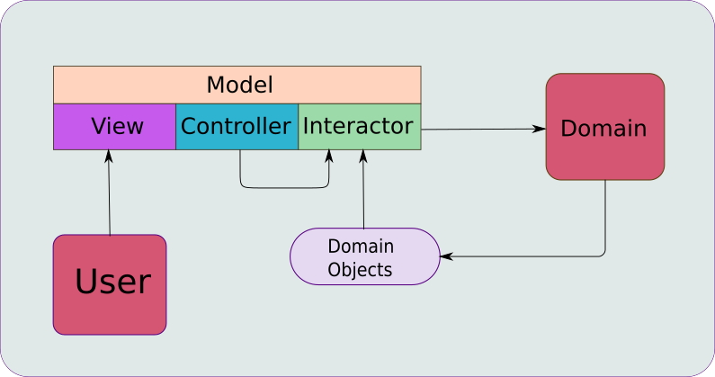
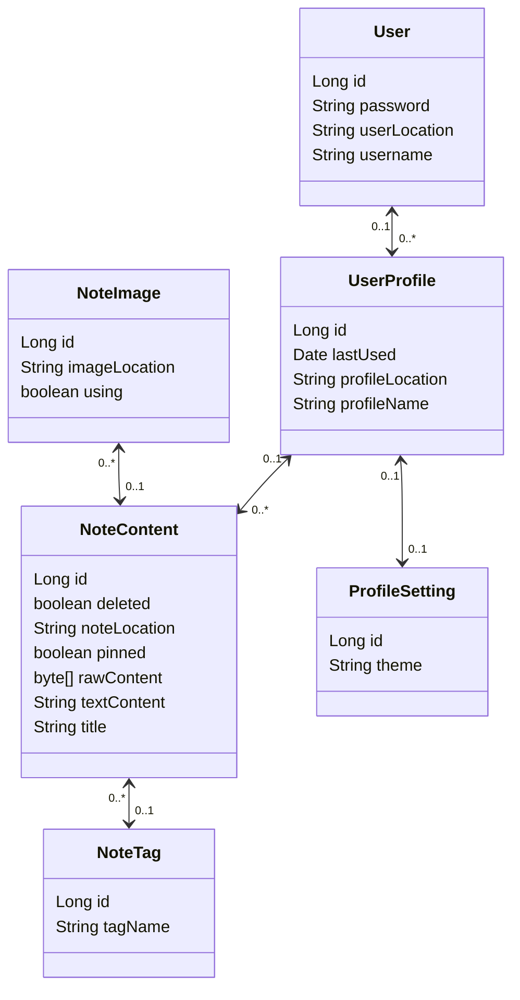
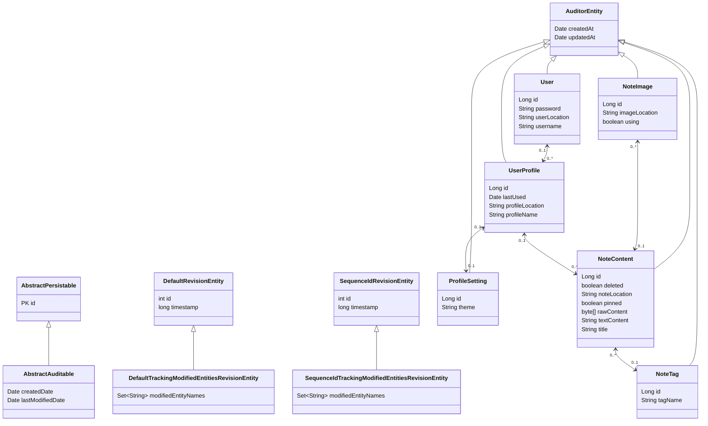
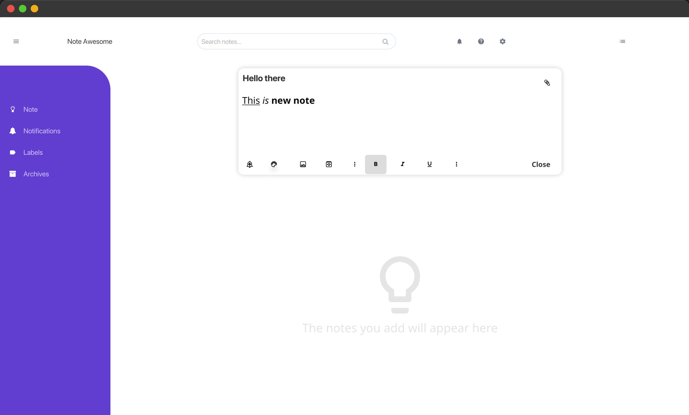
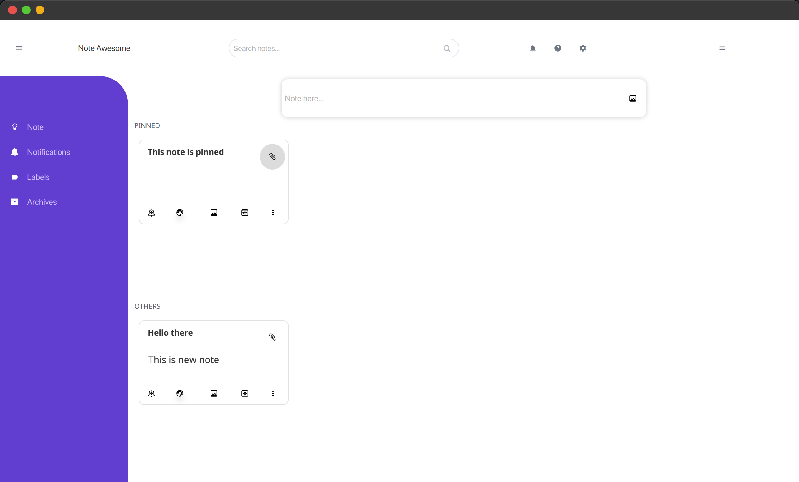
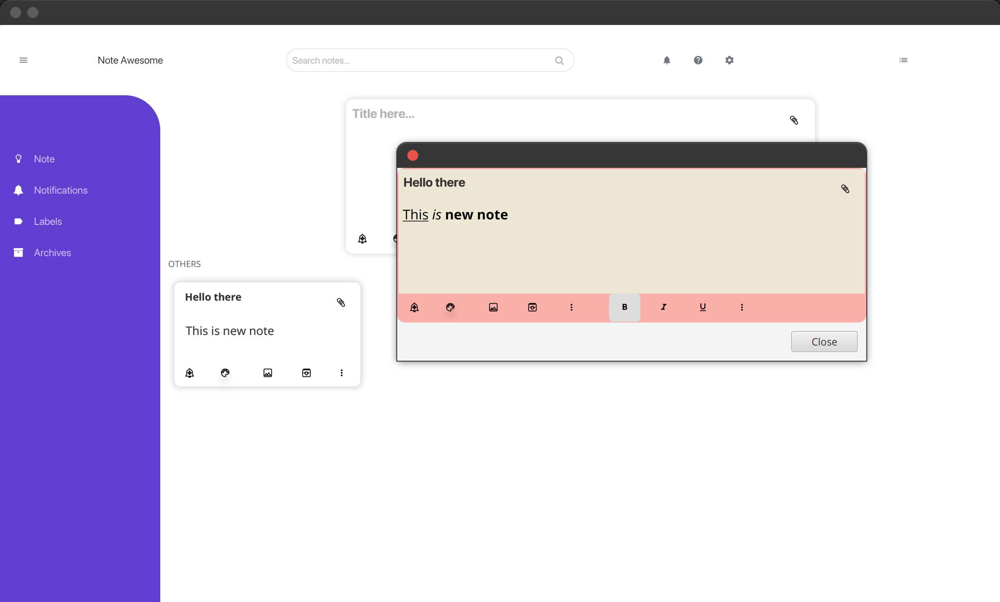
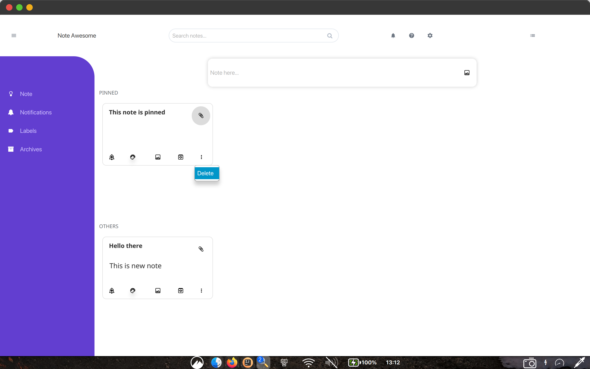

# Mô tả dự án

<!-- TOC -->

* [Mô tả dự án](#mô-tả-dự-án)
    * [1. Bài toán](#1-bài-toán)
    * [2. Giải pháp](#2-giải-pháp)
        * [2.1. Công nghệ sử dụng](#21-công-nghệ-sử-dụng)
        * [2.2. Giải pháp](#22-giải-pháp)
            * [2.2.1. Thiết kế cấu trúc ứng dụng](#221-thiết-kế-cấu-trúc-ứng-dụng)
                * [a. Mô hình MVC-I Layered Architecture](#a-mô-hình-mvc-i-layered-architecture)
                * [b. Cấu trúc dự án](#b-cấu-trúc-dự-án)
            * [2.2.2. Thiết kế cơ sở dữ liệu](#222-thiết-kế-cơ-sở-dữ-liệu)
            * [2.2.3. Lưu đồ giải thuật](#223-lưu-đồ-giải-thuật)
            * [2.2.4 Chức năng ứng dụng](#224-chức-năng-ứng-dụng)
                * [a. Chức năng tài khoản](#a-chức-năng-tài-khoản)
                * [b. Tải ghi chú từ cơ sở dữ liệu](#b-tải-ghi-chú-từ-cơ-sở-dữ-liệu)
                * [b. Chức năng ghi chú](#b-chức-năng-ghi-chú)
                    * [i. Tạo ghi chú](#i-tạo-ghi-chú)
                    * [ii. Sửa ghi chú](#ii-sửa-ghi-chú)
                    * [iii. Xóa ghi chú](#iii-xóa-ghi-chú)
                    * [iv. Một số chức năng nhỏ khác](#iv-một-số-chức-năng-nhỏ-khác)
    * [3. Tổng Kết](#3-tổng-kết)

<!-- TOC -->

## 1. Bài toán

- Về phía người dùng:
    - Xây dựng ứng dụng quản lý ghi chú cá nhân, cho phép người dùng tạo, sửa, xóa ghi chú.
    - Quản lý ghi chú người dùng tập trung, hướng tại Portable App, nghĩa là người dùng có thể sử dụng ứng dụng mà không
      cần cài đặt.
- Về phía phát triển:
    - Học tập, tổng kết kiến thức đã học.
    - Tìm hiểu nghiên cứu thêm về JavaFX, Spring Data, Spring Boot.

## 2. Giải pháp

### 2.1. Công nghệ sử dụng

- Nhóm quyết định sử dụng JavaFX để xây dựng giao diện ứng dụng vì:
    - JavaFX là một nền tảng phát triển ứng dụng đa nền tảng, hỗ trợ xây dựng ứng dụng giao diện người dùng (GUI) hiện
      đại, đẹp mắt.
    - JavaFX hỗ trợ CSS, FXML, Scene Builder, hỗ trợ tạo giao diện một cách dễ dàng.
    - Tuy nhiên, có một số nhược điểm như:
        - Phức tạp hơn so với một số framework.
        - Các framwork hỗ trợ ứng dụng deskop cho JavaFX không nhiều.

- Nhóm quyết định sử dụng Spring Data JPA vì:
    - Spring Data JPA là một phần của Spring Data, giúp giảm thiểu việc lập trình, đặc biệt là việc lập trình với cơ sở
      dữ liệu.
    - Trong Spring Data JPA, nhóm sử dụng dụng Hibernate ORM để tương tác với cơ sở dữ liệu.

- Nhóm quyết định sử dụng Spring Boot vì:
    - Sử dụng kỹ thuật Dependency Injection của Spring Framework.

### 2.2. Giải pháp

#### 2.2.1. Thiết kế cấu trúc ứng dụng

##### a. Mô hình MVC-I Layered Architecture

- Ứng dụng ghi chú này nhóm quyết định sử dụng mô hình MVC-I Layered Architecture:

<figure align="center">
    
    <figcaption>Model-View-Controller-Interactor</figcaption>
</figure>

- Áp dụng kỹ thuật **Dependency Injection** của **Spring Framework**:
    - **Dependency Injection** là một kỹ thuật lập trình mà một đối tượng nhận các phụ thuộc của nó từ bên ngoài.
    - **Spring Framework** hỗ trợ **Dependency Injection** thông qua **Spring IoC Container**.
    - **Spring IoC Container** quản lý các **Bean** và **Dependency Injection** giữa các **Bean**.
    - Mỗi **Bean** được đánh dấu bởi các **Annotation** như **@Component**, **@Repository**.

    <figure align="center">
        
        <figcaption>Spring Dependency Injection</figcaption>
    </figure>

    - Khi một **Bean** được yêu cầu, các class phụ thuộc các sẽ được Inject thông qua **Constructor**.

##### b. Cấu trúc dự án

- Nhìn tổng quan cấu trúc thư mục của ứng dụng:

```bash
├── NoteAwesomeApplication.class
├── NoteAwesomeEnv$Resource.class
├── NoteAwesomeEnv$ViewComponent.class
├── NoteAwesomeEnv.class
├── NoteAwesomeFX.class
├── StageInitializer.class
├── StageReadyEvent.class
├── controllers
├── core
├── css
├── extensions
├── fonts
├── fxml
├── images
├── interactors
├── models
├── note_awesome.mv.db
├── services
├── user_data
└── views
```

- Trong đó:
    - **Model**:
        - Thể hiện ở folder [**models**](../src/main/java/com/note_awesome/models/).
        - Tầng này chứa các class, enum đảm nhiệm vai trò:
        - Giao tiếp giữa các tần **View** và **Controller**.
        - Lưu trữ dữ liệu từ người dùng nhập vào, và dữ liệu từ **Controller** trả về.
        - Sử dụng cơ chế **Binding** và **Observer** để cập nhật dữ liệu giữa **View** và **Controller**.
        - Được đánh dấu bởi **@Component**.
        - Quy tắc đặt tên: **Tên Class** + **ViewModel**.
        ```bash
              tree src/main/java/com/note_awesome/models
              src/main/java/com/note_awesome/models
              ├── ISessionViewModel.java
              ├── NoteBackgroundColor.java
              ├── NoteBackgroundImage.java
              ├── NoteCardViewModel.java
              ├── NoteEditorViewModel.java
              ├── NoteViewModel.java
              ├── SessionViewModel.java
              └── ViewStateViewModel.java
      ```

    - **View**:
        - Tầng này là nơi hiển thị dữ liệu cho người dùng, nhận dữ liệu từ **Controller** và hiển thị dữ liệu đó.
            - Trong JavaFX, tầng này gồm thành phần con:
                - **FXML**: là một ngôn ngữ định nghĩa giao diện người dùng, tương tự như HTML.
                ```bash 
                    tree src/main/resources/com/note_awesome/fxml/
                    src/main/resources/com/note_awesome/fxml/
                    ├── MainWindow.fxml
                    └── note_views
                    ├── NoteBar.fxml
                    ├── NoteCard.fxml
                    ├── NoteEditor.fxml
                    └── NoteView.fxml
              ```
                - **CSS**: là một ngôn ngữ định nghĩa giao diện người dùng, tương tự như CSS.
                  ```bash
                   tree src/main/resources/com/note_awesome/fxml/
                      src/main/resources/com/note_awesome/fxml/
                      ├── MainWindow.fxml
                      └── note_views
                      ├── NoteBar.fxml
                      ├── NoteCard.fxml
                      ├── NoteEditor.fxml
                      └── NoteView.fxml
                  ```
                - **Images**: là nơi chứa các hình ảnh, icon sử dụng trong ứng dụng.
                     ```bash
                  tree src/main/resources/com/note_awesome/images/
                  src/main/resources/com/note_awesome/images/
                  ├── celebration_light_0714.png
                  ├── celebration_light_0714.svg
                  ├── celebration_light_thumb_0715.png
                  ├── celebration_light_thumb_0715.svg
                  ├── food_light_0609.png
                  ├── food_light_0609.svg
                  ├── food_light_thumb_0615.png
                  ├── food_light_thumb_0615.svg
                  ├── grocery_light_0609.png
                  ├── grocery_light_0609.svg
                  ├── grocery_light_thumb_0615.png
                  ├── grocery_light_thumb_0615.svg
                  ├── music_light_0609.png
                  ├── music_light_0609.svg
                  ├── music_light_thumb_0615.png
                  ├── music_light_thumb_0615.svg
                  ├── notes_light_0609.png
                  ├── notes_light_0609.svg
                  ├── notes_light_thumb_0615.png
                  ├── notes_light_thumb_0615.svg
                  ├── places_light_0609.png
                  ├── places_light_0609.svg
                  ├── places_light_thumb_0615.png
                  ├── places_light_thumb_0615.svg
                  ├── recipe_light_0609.png
                  ├── recipe_light_0609.svg
                  ├── recipe_light_thumb_0615.png
                  ├── recipe_light_thumb_0615.svg
                  ├── travel_light_0614.png
                  ├── travel_light_0614.svg
                  ├── travel_light_thumb_0615.png
                  ├── travel_light_thumb_0615.svg
                  ├── video_light_0609.png
                  ├── video_light_0609.svg
                  ├── video_light_thumb_0615.png
                  └── video_light_thumb_0615.svg
                  ```
                - **Fonts**: là nơi chứa các font sử dụng trong ứng dụng.
                     ```bash
                  tree src/main/resources/com/note_awesome/fonts/
                  src/main/resources/com/note_awesome/fonts/
                  └── SFProDisplay_Regular.otf
                  ```
                - **views**:
                    - Đây là thành phần chính của tầng **View**.
                    - Vì ứng dụng này sử dụng JavaFX, nên mỗi file **FXML** tương ứng với một một controller riêng,
                      là thành phần xử lý logic của **View**. Quy tắc đặt tên: **Tên View** + hậu tố **FxController**.
                    - Ngoài ra xuất hiện thêm thành phần **Builder**, mục đích nhằm tách biệt việc xây dựng **View** và **Controller**. Quy tắc đặt tên: **Tên View** + hậu tố **Builder**.
                    - Các class trong đây không quản lý bởi **Spring IoC Container** mà do quá trình khởi tạo chủ động từ các class **Controller**.
                    ```bash
                    tree src/main/java/com/note_awesome/views/
                    src/main/java/com/note_awesome/views/
                    ├── MainWindowFxController.java
                    ├── MainWindowViewBuilder.java
                    ├── core_editors
                    │ ├── EmptyLinkedImage.java
                    │ ├── FoldableStyleArea.java
                    │ ├── Indent.java
                    │ ├── LinkedImage.java
                    │ ├── LinkedImageOps.java
                    │ ├── NoteEditorFxController.java
                    │ ├── ParStyle.java
                    │ ├── RealLinkedImage.java
                    │ └── TextStyle.java
                    └── note_views
                      ├── NoteBarFxController.java
                      ├── NoteCardCell.java
                      ├── NoteCardFxController.java
                      ├── NoteViewBuilder.java
                      └── NoteViewFxController.java
                    ```
    - **Controller**:
        - Tầng Controller chứa các class đảm nhiệm việc điều khiển luồng dữ liệu giữa **Model** và **Interactor**.
        - Tầng **Controller** biết về tầng **Model**, **Interactor**, giao tiếp với **View** thông qua các **Function Interface**
          và **Event**.
        - Quy tắc đặt tên: **Tên Class** + **Controller**.
      ```bash
        tree src/main/java/com/note_awesome/controllers/
        src/main/java/com/note_awesome/controllers/
        ├── MainWindowController.java
        ├── NoteEditorController.java
        └── NoteViewController.java
      ```
    - **Interactor**:
        - Tầng này giống như tên gọi, thực hiện các tác vụ gọi xuống tầng **Service**, phản hồi dữ liệu về tầng **Controller** khi được yêu cầu.
        - Interactor biế về tầng **Service** thông qua trừu tượng, tức các *interface*, biết về *domain* và *model*.
        - Quy tắc đặt tên: **Tên Class** + **Interactor**.
      ```bash
        tree src/main/java/com/note_awesome/interactors/
        src/main/java/com/note_awesome/interactors/
        └── NoteViewInteractor.java
      ```

    - **Service**:
        - Là tầng chính của ứng dụng, chứa các class thực hiện các tác vụ cụ thể, như thêm, sửa, xóa, tìm kiếm dữ
          liệu.
        - Đảm bảo việc tương tác với cơ sở dữ liệu thông qua **Repository**.
        - Đảm bảo tính toàn vẹn dữ liệu, xử lý nghiệp vụ.
        - Mỗi service tương ứng với một **Entity** trong cơ sở dữ liệu, đồng thời chứa các **Validator** để kiểm tra
          dữ liệu.
        - Quy tắc đặt tên: **Tên Class** + **Service**.
      ```bash
        tree src/main/java/com/note_awesome/services
        src/main/java/com/note_awesome/services
        ├── FakeAppService.java
        ├── IAppBaseService.java
        ├── authentication_services
        │ ├── AuthenticationService.java
        │ ├── IAuthenticationService.java
        │ └── validators
        │     ├── AuthAbstractValidator.java
        │     ├── AuthBasicValidator.java
        │     ├── AuthValidator.java
        │     └── IAuthBasicValidator.java
        ├── note_services
        │ ├── CreateNoteContentService.java
        │ ├── ICreateNoteContentService.java
        │ ├── INoteContentBaseService.java
        │ ├── INoteContentDeleteService.java
        │ ├── INoteContentQueryService.java
        │ ├── INoteContentUpdateService.java
        │ ├── NoteContentAbstractValidator.java
        │ ├── NoteContentDeleteService.java
        │ ├── NoteContentQueryService.java
        │ ├── NoteContentService.java
        │ ├── NoteContentUpdateService.java
        │ └── validators
        │     ├── CreateNoteContentValidator.java
        │     ├── DeleteNoteContentValidator.java
        │     ├── INoteContentBasicValidator.java
        │     ├── NoteContentBasicValidator.java
        │     └── UpdateNoteContentValidator.java
        ├── user_profile_services
        │ ├── CreateUsrProfService.java
        │ ├── ICreateUsrProfService.java
        │ ├── IUserProfileBaseService.java
        │ ├── IUsrProfQueryService.java
        │ ├── UserProfileService.java
        │ ├── UsrProfQueryService.java
        │ ├── UsrProfileAbstractValidator.java
        │ └── validators
        │     ├── CreateUsrProfileValidator.java
        │     ├── IUsrProfileBasicValidator.java
        │     └── UsrProfileBasicValidator.java
        └── user_services
            ├── CreateUserService.java
            ├── ICreateUserService.java
            ├── IUserService.java
            ├── UserAbstractValidator.java
            ├── UserService.java
            └── validators
                ├── CreateUserValidator.java
                ├── IUserBasicValidator.java
                └── UserBasicValidator.java
      ```

        - **core**:
            - Đây là nơi chứa các:
                - **Entity**:
                    - Đây là các **POJO** (Plain Old Java Object) đại diện cho các bảng trong cơ sở dữ liệu, được đánh dấu bởi **@Entity**.
                      //TODO: Add mermaid diagram
                    - Entity **User**:
                    ```mermaid
                  classDiagram
                    direction BT
                    class AuditorEntity {
                    - Date createdAt
                      - Date updatedAt
                        }
                        class User {
                      - Long id
                      - String password
                      - List~UserProfile~ profiles
                      - String username
                      - String userLocation
                        }
                  
                    User  -->  AuditorEntity
                    ``` 
                    - Entity **UserProfile**:
                    ```mermaid
                - **Repository**
                - **Configuration**
            - Đây là nơi định nghĩa cấu trúc cơ sở dữ liệu, đồng thời cung cấp các phương thức để tương tác với cơ
              sở dữ
              liệu.
            - Sử dụng **Spring Data JPA** để tương tác với cơ sở dữ liệu.
            - Các **Entity** là các **POJO** (Plain Old Java Object) đại diện cho các bảng trong cơ sở dữ liệu.
                - Các **Repository** là các interface đại diện cho các bảng trong cơ sở dữ liệu, đồng thời cung cấp
                  các
                  phương thức để tương tác với cơ sở dữ liệu.
          ```bash
            tree src/main/java/com/note_awesome/core/
            src/main/java/com/note_awesome/core/
            ├── entities
            │ ├── AuditorEntity.java
            │ └── note
            │     ├── NoteContent.java
            │     ├── NoteImage.java
            │     ├── NoteTag.java
            │     ├── ProfileSetting.java
            │     ├── User.java
            │     └── UserProfile.java
            └── repositories
              └── note
                ├── INoteContentRepository.java
                ├── INoteImageRepository.java
                ├── INoteTagRepository.java
                ├── IProfileSettingRepository.java
                ├── IUserProfileRepository.java
                ├── IUserRepository.java
                └── NoteJpaConfig.java
          ```
    - **extensions**:
        - Đây là nơi chứa các class hỗ trợ cho việc viết code.
      ```bash
        tree src/main/java/com/note_awesome/extensions/
        src/main/java/com/note_awesome/extensions/
        ├── Error.java
        ├── IInitialize.java
        ├── IResult.java
        ├── IValidator.java
        └── Result.java
      ```

#### 2.2.2. Thiết kế cơ sở dữ liệu

- Về mặt thiết kế cơ sở dữ liệu nhóm quyết định sử dụng **H2 Database** vì:
    - H2 Database là một cơ sở dữ liệu quan hệ mã nguồn mở, hỗ trợ nhiều chế độ hoạt động như in-memory, file mode,
      server mode.
    - Ưu điểm của nó chính là việc Portable, nghĩa là khi áp được triển khai đến người dùng, thì người dùng không cần
      cài đặt bất kỳ hệ quản trị cơ sở dữ liệu nào.

- Lược đồ cơ sở dữ liệu chính:



- Lược đồ cơ sở dữ liệu thực tế khi sử dụng **Spring Data JPA**:



#### 2.2.3. Lưu đồ giải thuật

<figure align="center">
    
    <figcaption>Lưu đồ giải thuật dự kiến</figcaption>
</figure>

#### 2.2.4 Chức năng ứng dụng

##### a. Chức năng tài khoản

- Ý tưởng:
    - Một người dùng có thể tạo nhiều tài khoản.
    - Mỗi tài khoản sở hữu nhiều Profile khác nhau.
    - Mỗi tài khoản sở hữu một cấu hình riêng.
    - Điều này thể hiện thông qua mối quan hệ trên [**Lược đồ cơ sở dữ liệu**](#lược-đồ-cơ-sở-dữ-liệu-chính).
    - Khi đăng ký tài khoản:
        - Người dùng cung cấp thông tin tài khoản như: **username**, **password**.
        - Các thông tin này được kiểm tra tính hợp lệ, **password** được mã hóa trước khi lưu vào cơ sở dữ liệu.
        - Nếu chưa từng tạo tài khoản, sẽ tạo ra một đường dẫn *user_data/{tên folder ngẫu nhiên}* để lưu trữ dữ liệu
          của tài khoản này.
    - Khi đăng nhập:
        - Người dùng cung cấp thông tin tài khoản: **username**, **password**.
        - Gọi hàm kiểm tra tài khoản, nếu thông tin đúng, trả về thông tin tài khoản.
        - Nếu thông tin không đúng, trả về thông báo lỗi.

- Hiện thực:
    - Nhóm chưa hoàn thiện chức năng này.
    - Tuy nhiên, nhóm đã tạo ra một class [**FakeAppService
      **](../src/main/java/com/note_awesome/services/FakeAppService.java) để mô phỏng chức năng này.
  ```java
      private void generateTestData(User user, UserProfile userProfile) {
        TEST_USER.setUsername("test");
        TEST_USER.setPassword("test");
        TEST_USER.setUserLocation(NoteAwesomeEnv.USER_DATA_FOLDER_PATH);

        TEST_USER_PROFILE.setProfileName("test_profile");
        TEST_USER_PROFILE.setProfileSetting(null);
        TEST_USER_PROFILE.setProfileLocation(TEST_USER.getUserLocation());

        var can_create_new_user = this.userService.getCreateUserService().create(TEST_USER);
        if (!can_create_new_user.isSuccess()) {
            logger.error("Error creating test user{}", can_create_new_user.getError().Description());
            return;
        }

        var can_create_new_profile = this.userProfileService.getCreateUsrProfService().create(TEST_USER_PROFILE.getProfileName(), TEST_USER_PROFILE.getProfileLocation(), can_create_new_user.getValue().getId());
        if (!can_create_new_profile.isSuccess()) {
            logger.error("Error creating test user profile");
            return;
        }
    }
  ```
    - Hàm sẽ tạo ra một tài khoản và một profile mặc định khi ứng dụng chạy.
    - Sau khi tạo xong, gọi [**AuthenticationService**](../src/main/java/com/note_awesome/services/authentication_services/AuthenticationService.java) để kiểm tra
      thông tin tài khoản.
    - Nếu khớp -> đăng nhập thành công, -> tạo ra một class [**SessionViewModel**](../src/main/java/com/note_awesome/models/SessionViewModel.java) để lưu trữ thông tin tài khoản cho phiên làm việc.
    - Nếu không khớp -> đăng nhập thất bại.

##### b. Tải ghi chú từ cơ sở dữ liệu

- Ý tưởng:
    - Khi người dùng đăng nhập thành công, hệ thống sẽ tải toàn bộ ghi chú của người dùng từ cơ sở dữ liệu.
    - Ứng dụng sẽ hiển thị toàn bộ ghi chú đã tạo ra trước đó.
    - Điều này thể hiện thông qua hàm [**refreshNoteBoard**](../src/main/java/com/note_awesome/interactors/NoteViewInteractor.java).
  ```java
    public void refreshNoteBoard() {
        this.noteVm.getPinnedNotes().clear();
        this.noteVm.getUnpinnedNotes().clear();

        var noteContents = this.noteContentBaseService.getNoteContentQueryService().getDefaultNoteContents(this.sessionViewModel.getCurrentUsrProfId().get());

        if (noteContents.isSuccess()) {
            noteContents.getValue().forEach(noteContent -> {
                if (noteContent.pinned()) {
                    updatePinnedNoteCard(noteContent);
                } else {
                    updateUnpinnedNoteCard(noteContent);
                }
            });
        } else {
            this.logger.error("Error occurred while getting default note contents: {}", noteContents.getError());
        }
    }
    ```
    - Những ghi chú được load lên sẽ phải đáp ứng một số điều kiện:
        - Ghi chú không bị xóa.
        - Ghi chú thuộc về profile hiện tại.
    ```java
    @Query("select n from NoteContent n LEFT JOIN FETCH n.noteImages i where n.userProfile.id = ?1 and n.deleted = false")
    List<NoteContent> findDefaultNoteContentByUsrProfId(@NonNull Long userProfileId);
    ```

##### b. Chức năng ghi chú

###### i. Tạo ghi chú

<figure align="center">
    
    <figcaption>Chức năng tạo ghi chú</figcaption>
</figure>

- Ý tưởng:
    - Để đáp ứng cho việc tạo ghi chú nhanh, khi người dùng click vào **NoteBar**, chương trình mở một **NoteEditor** mới.
    - Điều kiện để tạo ghi chú:
        - Ghi chú không được rỗng:
            - Phải tồn tại ít nhất một ký tự trong **Note Title** hoặc **Note Content**.
            - Hoặc import ít nhất một hình ảnh.
    - Sau khi người dùng ấn nút **Close** hoặc click ra ngoài **NoteEditor**, chương trình sẽ kiểm tra điều kiện để lưu ghi chú:
        - Nếu ghi chú không rỗng, lưu ghi chú vào cơ sở dữ liệu.
        - Nếu ghi chú rỗng, không lưu ghi chú.
- Hiện thực:
  ```java
  /*/src/main/java/com/note_awesome/interactors/NoteViewInteractor.java*/
      public void createNote() {
        if (!canCreateNote()) {
            return;
        }
        var newNote = mapNoteEditorVmToNoteContent(this.createNoteEditorVm);
        this.noteContentBaseService.getCreateNoteContentService().create(newNote, this.sessionViewModel.getCurrentUsrProfId().get()).Match((noteContent) -> {
            this.noteContent = Optional.of(noteContent);
            return Result.success(noteContent);
        }, error -> {
            logger.error("Error occurred while creating note: {}", error);
            return Result.failure(error);
        });
        refreshNoteEditor(this.createNoteEditorVm);
    }
  ```
    - Vào lúc đóng **NoteEditor**, hệ thống sẽ kiểm tra điều kiện để lưu ghi chú:
        - Nếu ghi chú không rỗng, lưu ghi chú vào cơ sở dữ liệu.
        - Nếu ghi chú rỗng, không lưu ghi chú.
        - Mã hóa nội dung của ghi chú trước khi lưu vào cơ sở dữ liệu:
        ```java
        /*/src/main/java/com/note_awesome/views/core_editors/NoteEditorFxController.java*/
        private void save(OutputStream outputStream) {
        var doc = area.getDocument();

        area.getStyleCodecs().ifPresent(codecs -> {
            var codec = ReadOnlyStyledDocument.codec(codecs._1, codecs._2, this.area.getSegOps());
            try (var dataOs = new DataOutputStream(outputStream)) {
                codec.encode(dataOs, doc);
            } catch (IOException e) {
                throw new RuntimeException(e);
            }
        });
      }
      ```
    - Khi một ghi chú được tạo mới (thể hiện thông qua class NoteContent) được chuyển đến [**CreateNoteContentService**](../src/main/java/com/note_awesome/services/note_services/CreateNoteContentService.java).
        - Thực hiện kiểm tra tất cả các field đảm bảo điều kiện của [**CreateNoteContentValidator**](../src/main/java/com/note_awesome/services/note_services/validators/CreateNoteContentValidator.java).
        - Sau đó, ghi chú sẽ thực hiện:
            - Tạo ra một thư mục với tên ngẫu nhiên dưới đường dẫn *user_data/{current_user_profile}/{tên thư mục ngẫu nhiên}* để lưu trữ hình ảnh.
            - Nếu ghi chú có hình ảnh -> copy hình ảnh vào thư mục vừa tạo.
              ```java
              private Result<ArrayList<NoteImage>, Error> copyImagesToNoteLocation(List<NoteImage> imageUrls, Path noteLocation) {
              var copiedImageUrls = new ArrayList<NoteImage>();
              for (var imageUrl : imageUrls) {
                  try {
                      var srcFile = new File(imageUrl.getImageLocation());
                      var ext = FilenameUtils.getExtension(imageUrl.getImageLocation());
                      var destFile = new File(FilenameUtils.concat(noteLocation.toString(), generateUniqueName() + "." + ext));
                      int count = 0;
        
                      while (destFile.exists() && count < 2) {
                          destFile = new File(FilenameUtils.concat(noteLocation.toString(), generateUniqueName() + "." + ext));
                          count++;
                      }
        
                      if (destFile.exists()) {
                          return Result.failure(new Error("Error copying image to note location", "Error copying image to note location"));
                      }
        
                      FileCopyUtils.copy(srcFile, destFile);
                      copiedImageUrls.add(new NoteImage(destFile.getAbsolutePath(), imageUrl.isUsed(), imageUrl.getNoteContent()));
        
                  } catch (IOException e) {
                      for (var copiedImageUrl : copiedImageUrls) {
                          try {
                              Files.deleteIfExists(Path.of(copiedImageUrl.getImageLocation()));
                          } catch (IOException ex) {
                              return Result.failure(new Error("Error copying image to note location", "Error copying image to note location"));
                          }
                      }
                      return Result.failure(new Error("Error copying image to note location", "Error copying image to note location"));
                  }
              }
              return Result.success(copiedImageUrls);
              }
              ```
                - Lưu đường dẫn hình ảnh vào cơ sở dữ liệu.
                - Lưu nội dung ghi chú vào cơ sở dữ liệu.
    - Sau khi lưu xong, ghi chú sẽ được hiển thị trên giao diện
        <figure align="center">
            
            <figcaption>Hiển thị ghi chú</figcaption>
        </figure>
    - Tùy thuộc vào việc ghi chú được đánh dấu ghim hay không, ghi chú sẽ được hiển thị ở vị trí tương ứng.

###### ii. Sửa ghi chú

<figure align="center">
    
    <figcaption>Chức năng sửa ghi chú</figcaption>
</figure>

- Ý tưởng:
    - Khi người dùng click vào một ghi chú thể hiện thông qua **NoteCard**, hệ thống sẽ mở một **NoteEditor** mới.
    - Nội dung của ghi chú sẽ được hiển thị trên **NoteEditor**.
    - Người dùng có thể sửa nội dung của ghi chú.
    - Sau khi người dùng ấn nút **Close** hoặc click ra ngoài **NoteEditor**, chương trình sẽ kiểm tra điều kiện để lưu ghi chú:
        - Lúc này ghi chú có thể ghi vào cơ sở dữ liệu dù có nội dung hay không vì đã tồn tại trước đó, trở thành một ghi chú trống.
        - Nếu ghi chú có thêm hình ảnh, hệ thống sẽ thực hiện tương tự như chức năng tạo ghi chú.

- Hiện thực:
    - Khi người dùng click vào một **NoteCard**, hệ thống sẽ tải nội dung của ghi chú từ cơ sở dữ liệu dựa trên **id** của ghi chú.
    - Nếu không tìm thấy **id** của ghi chú, hệ thống sẽ hiển thị thông báo lỗi.
    - Ngược lại sẽ hiển thị nội dung của ghi chú lên **NoteEditor**:
        - Tải nội dung ghi chú bao gồm: **title**, **content**.
        - **content** sẽ được giải mã trước khi hiển thị lên **NoteEditor** thông qua hàm [**load**](../src/main/java/com/note_awesome/views/core_editors/NoteEditorFxController.java).
        ```java
    - Sau khi sửa đổi:
        - Ghi chú lúc này sẽ chấp nhận cả mọt ghi chú trống.
        - Cập nhật nội dung ghi chú vào cơ sở dữ liệu thông qua hàm [**updateNote**](../src/main/java/com/note_awesome/interactors/NoteViewInteractor.java).
        ```java
            public void updateNote() {
        var updatedNote = mapNoteEditorVmToNoteContent(this.updateNoteEditorVm);

        updatedNote.setId(this.updateNoteEditorVm.getId());

        this.noteContentBaseService.getUpdateNoteContentService().update(updatedNote.getId(), updatedNote.getTitle(), updatedNote.getTextContent(), updatedNote.pinned(), updatedNote.getRawContent()).Match((updatedNoteContent) -> {
            this.noteContent = Optional.of(updatedNoteContent);
            return Result.success(updatedNoteContent);
        }, error -> {
            logger.error("Error occurred while updating note: {}", error);
            return Result.failure(error);
        });

        this.noteVm.getUnpinnedNotes().removeIf(noteCardViewModel -> noteCardViewModel.getId() == updatedNote.getId());
        this.noteVm.getPinnedNotes().removeIf(noteCardViewModel -> noteCardViewModel.getId() == updatedNote.getId());
        refreshNoteEditor(this.updateNoteEditorVm);
        }
        ```
        - Hàm cập nhật ghi chú gọi [**UpdateNoteContentService**](../src/main/java/com/note_awesome/services/note_services/NoteContentUpdateService.java) để thực hiện cập nhật.
            - Kiểm tra điều kiện của [**UpdateNoteContentValidator**](../src/main/java/com/note_awesome/services/note_services/validators/UpdateNoteContentValidator.java).
            - Cập nhật nội dung ghi chú vào cơ sở dữ liệu.
            - Nếu ghi chú có hình ảnh, thực hiện tương tự như chức năng tạo ghi chú.
            - Nếu có bất kỳ lỗi nào xảy ra, cơ sở dữ liệu được rollback.
        - Sau khi cập nhật xong, cập nhật lại ghi chú trên giao diện.

          :warning: **Lưu ý**:
            - Hiện tại do chưa hoàn thiện chức năng thêm hình ảnh ghi chú nên các thao tác liên quan đến hình ảnh sẽ không được thực hiện.

###### iii. Xóa ghi chú

<figure align="center">
    
    <figcaption>Chức năng xóa ghi chú</figcaption>
</figure>

- Ý tưởng:
    - Khi một người dùng xóa ghi chú hiện tại, phần mềm sẽ thực hiện một thao tác xóa **mềm**, nghĩa là sẽ thay thế thuộc tính **deleted** của ghi chú từ **false** thành **true**.
    - Mục đích của việc xóa mềm là để giữ lại lịch sử của ghi chú, người dùng có thể khôi phục lại ghi chú đã xóa.
    - Khi một ghi chú bị xóa mềm, nó sẽ không còn hiển thị trên giao diện, nhưng vẫn tồn tại trong cơ sở dữ liệu.

    - Hiện thực:
        - Khi người dùng click vào nút **Delete** trên **NoteCard**, chương trình sẽ kiểm tra điều kiện để xóa ghi chú:
            - Nếu ghi chú không tồn tại, hiển thị thông báo lỗi.
            - Ngược lại, thực hiện xóa ghi chú thông qua hàm hệ thống sẽ thực hiện xóa mềm ghi chú thông qua hàm [**deleteNote**](../src/main/java/com/note_awesome/interactors/NoteViewInteractor.java).
        ```java
      public void deletePinnedNote(Long noteId) {
            if (noteId == null) {
                this.logger.error("Note id is null");
                return;
            }
  
            var deleteNote = this.noteContentBaseService.getDeleteNoteContentService().markAsDeleted(noteId);
  
            if (deleteNote.isSuccess()) {
                this.noteVm.getPinnedNotes().removeIf(noteCardViewModel -> noteCardViewModel.getId() == noteId);
            } else {
                this.logger.error("Error occurred while deleting note: {}", deleteNote.getError());
            }
        }
  
        public void deleteUnpinnedNote(Long noteId) {
            if (noteId == null) {
                this.logger.error("Note id is null");
                return;
            }
  
            var deleteNote = this.noteContentBaseService.getDeleteNoteContentService().markAsDeleted(noteId);
  
            if (deleteNote.isSuccess()) {
                this.noteVm.getUnpinnedNotes().removeIf(noteCardViewModel -> noteCardViewModel.getId() == noteId);
            } else {
                this.logger.error("Error occurred while deleting note: {}", deleteNote.getError());
            }
        }
        ```
        - Service xóa mềm:
      ```java
          @Transactional
        @Modifying
        @Query("update NoteContent n set n.deleted = ?1 where n.id = ?2")
        int updateDeletedById(@NonNull boolean deleted, @NonNull Long id);
      ```

###### iv. Một số chức năng nhỏ khác

    - **Ghim ghi chú**
    - **Trang trí cho một ghi chú**:
        - Bao gồm việc **bôi đậm**, **in nghiêng**, **gạch chân**.
        - Thêm một số background khi gõ nội dung ghi chú (tuy nhiên chưa lưu trạng thái của background vào cơ sở dữ liệu).

## 3. Tổng Kết

- Mặc dù nhóm đã cố gắng hoàn thiện ứng dụng, tuy nhiên vẫn còn một số chức năng chưa được hoàn thiện.
- Trong thời gian có hạn, với sự nỗ lực của hai thành viên, nhóm đã hoàn thiện được một số chức năng cơ bản của ứng dụng.
- Nhóm đã học được rất nhiều từ việc xây dựng ứng dụng này, từ việc thiết kế cơ sở dữ liệu, thiết kế giao diện, viết code, kiểm thử, ...
